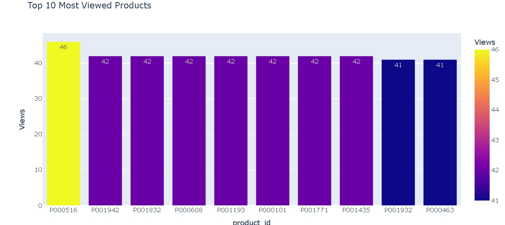
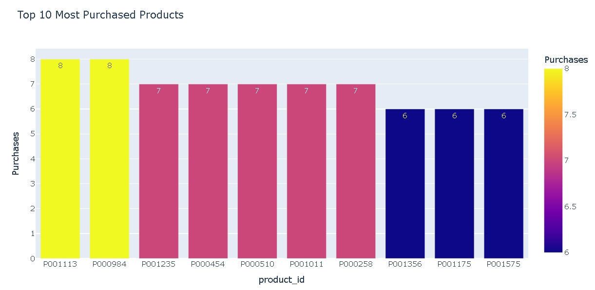
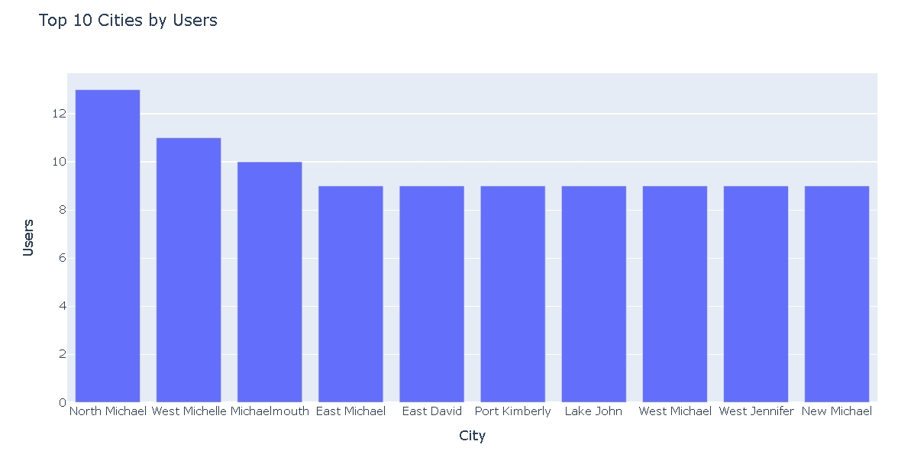
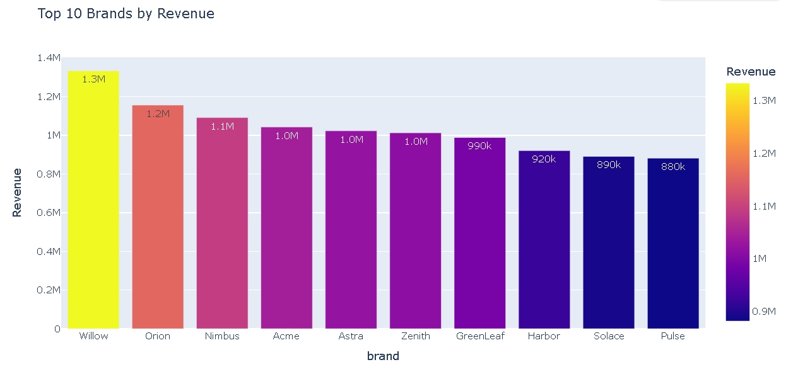
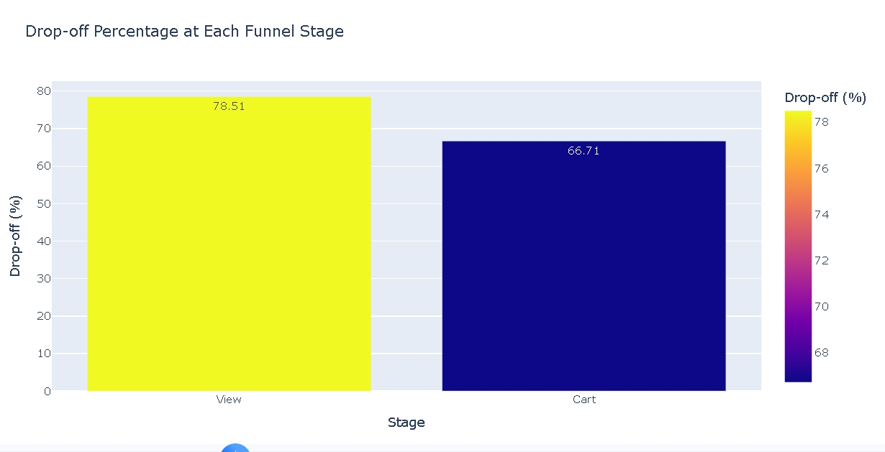
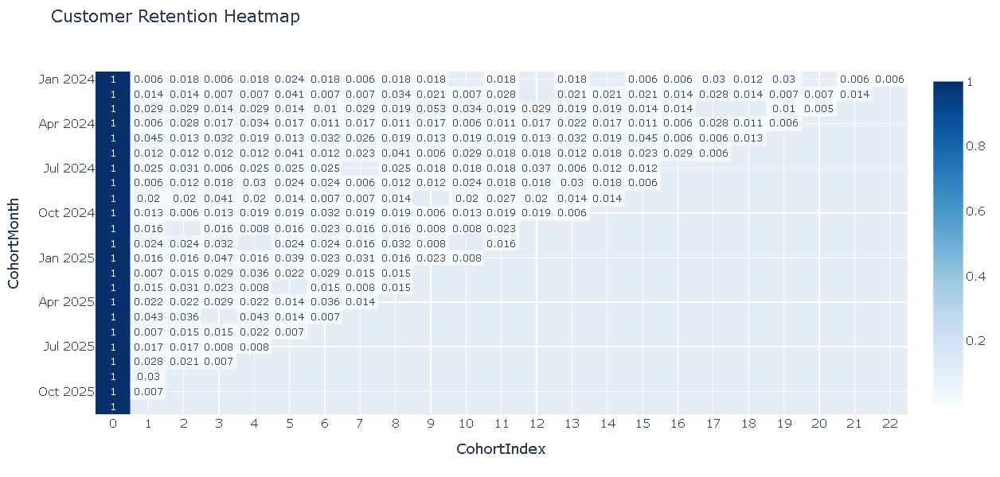
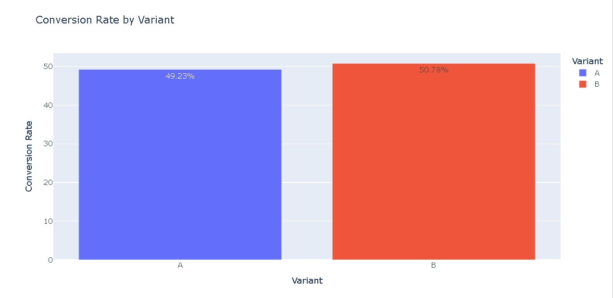

# 📊 UserFlow Analytics – Product Growth & A/B Testing

An end-to-end Product Analytics project that analyzes user behavior, customer retention, product performance, and revenue trends using Python, SQL, and interactive visualizations.

---

## 📌 Project Overview

UserFlow Analytics is a comprehensive analytics project built on a synthetic e-commerce dataset. The project demonstrates the complete analytics workflow—from data cleaning and exploratory data analysis (EDA) to customer segmentation, funnel analysis, cohort analysis, A/B testing, SQL-based business analysis, and executive reporting.

The goal is to derive actionable business insights that help improve customer engagement, product performance, and revenue growth.

---

## 🎯 Business Objectives

- Analyze customer purchasing behavior.
- Identify high-performing products and categories.
- Measure customer retention over time.
- Analyze user conversion funnels.
- Perform A/B testing for business decision-making.
- Generate actionable business recommendations.

---

## 🛠️ Tech Stack

- Python
- Pandas
- NumPy
- Plotly
- DuckDB (SQL)
- SciPy
- Matplotlib
- Google Colab

---

## 📂 Dataset

The project uses a synthetic e-commerce dataset containing:

- Users
- Products
- Orders
- Order Items
- User Events
- Product Reviews

---

## 🔄 Project Workflow

### 1. Data Collection
- Import datasets
- Data validation

### 2. Data Cleaning
- Missing value handling
- Duplicate removal
- Datetime conversion
- Data type correction

### 3. Exploratory Data Analysis
- Product analysis
- Customer analysis
- Revenue analysis
- Brand analysis

### 4. Business KPIs
- Total Revenue
- Total Orders
- Total Users
- Total Products
- Average Order Value

### 5. Product Analytics
- Revenue by Category
- Top Products
- Brand Performance
- Monthly Revenue Trend

### 6. Customer Analytics
- Customer Segmentation
- Average Revenue by Segment
- Top Customers

### 7. Funnel Analysis
- View → Cart → Purchase Funnel
- Drop-off Analysis

### 8. Cohort Analysis
- Customer Retention Matrix
- Retention Heatmap

### 9. A/B Testing
- Variant Comparison
- Conversion Rate Analysis
- Chi-Square Statistical Test

### 10. SQL Business Analysis
Business insights generated using DuckDB SQL.

---

# 📈 Key Insights

- Electronics generated the highest revenue.
- A small number of products contributed significantly to overall sales.
- Customer retention decreased considerably after the first purchase.
- The largest conversion drop occurred between product views and cart additions.
- Platinum customers generated the highest average revenue.
- A/B testing demonstrated how experimentation supports data-driven decision-making.

---

# 📷 Project Screenshots

## Top Viewed Producds



---

## Top Products



---

## Top Cities



---

## Top Brands



---

## Dropoff Analysis



---

## Customer Retention Heatmap



---

## A/B Testing



---

# 💡 Business Recommendations

- Improve the View → Cart conversion stage.
- Introduce loyalty programs for high-value customers.
- Promote high-performing product categories.
- Improve customer retention using personalized campaigns.
- Continue A/B testing before implementing major product changes.

---

# 🚀 Future Improvements

- Deploy as a Streamlit dashboard.
- Connect to Google BigQuery.
- Automate ETL pipelines.
- Implement customer churn prediction.
- Build sales forecasting models.

---

# 📁 Project Structure

```
UserFlow-Analytics/
│
├── UserFlow_Analytics.ipynb
├── README.md
├── requirements.txt
├── LICENSE
│
├── images/
│   ├── revenue_trend.png
│   ├── category_revenue.png
│   ├── top_products.png
│   ├── customer_segments.png
│   ├── funnel_analysis.png
│   ├── cohort_heatmap.png
│   └── ab_testing.png
│
└── data/
```

---

# ▶️ How to Run

1. Clone the repository

```bash
git clone https://github.com/YukthaK215/UserFlow-Analytics.git
```

2. Install dependencies

```bash
pip install -r requirements.txt
```

3. Open the notebook

```bash
jupyter notebook UserFlow_Analytics.ipynb
```

or upload the notebook to **Google Colab**.

---

# 👩‍💻 Author

**Yuktha K**

GitHub: https://github.com/YukthaK215

---

## ⭐ If you found this project useful, consider giving it a Star!
